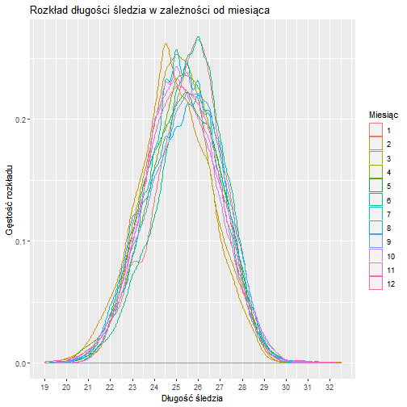
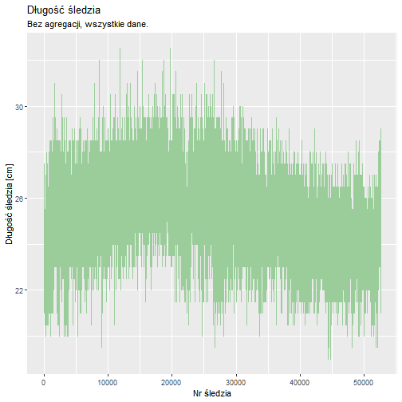
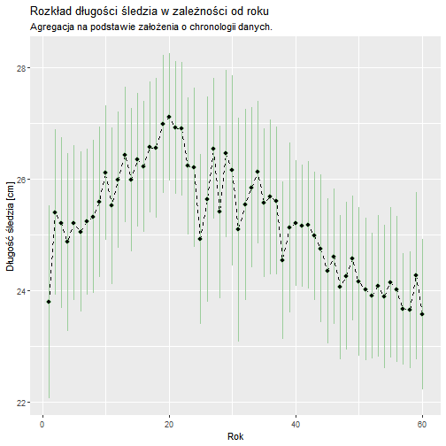
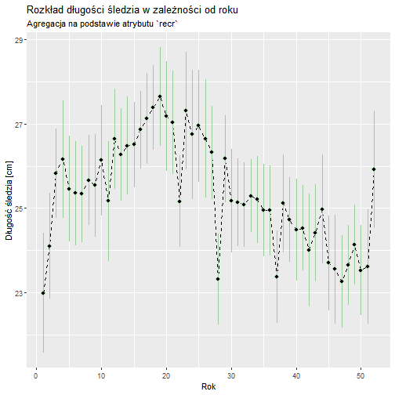
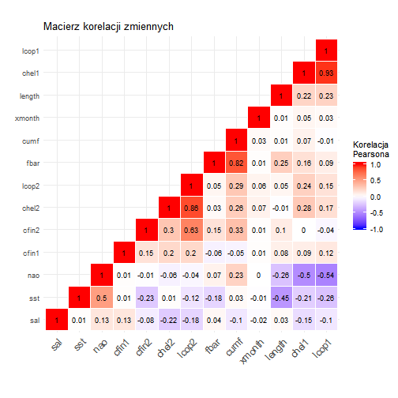

# Raport z analizy długości śledzia oceanicznego

Animacja jak i cały raport są dostępne poprzez aplikację napisaną z wykorzystaniem biblioteki `shiny`. Aby uruchomić aplikację należy, w konsoli R wpisać komendę:

```
library(shiny)
runApp()
```

## Cel analizy

Celem analizy jest określenie jakie mogą być główne przyczyny stopniowego zmniejszania się długości śledzi oceanicznych wyławianych w Europie.

## Zbiór danych

Na przestrzeni ostatnich lat zauważono stopniowy spadek rozmiaru śledzia oceanicznego wyławianego w Europie. Do analizy zebrano pomiary śledzi i warunków w jakich żyją z ostatnich 60 lat. Dane były pobierane z połowów komercyjnych jednostek. W ramach połowu jednej jednostki losowo wybierano od 50 do 100 sztuk trzyletnich śledzi. Zbiór danych zawiera 52582 rekordy, każdy z nich posiada 16 atrybutów:
* indeks
* `length`: długość złowionego śledzia [cm],
* `cfin1`: dostępność planktonu [zagęszczenie Calanus finmarchicus gat. 1],
* `cfin2`: dostępność planktonu [zagęszczenie Calanus finmarchicus gat. 2],
* `chel1`: dostępność planktonu [zagęszczenie Calanus helgolandicus gat. 1],
* `chel2`: dostępność planktonu [zagęszczenie Calanus helgolandicus gat. 2],
* `lcop1`: dostępność planktonu [zagęszczenie widłonogów gat. 1],
* `lcop2`: dostępność planktonu [zagęszczenie widłonogów gat. 2],
* `fbar`: natężenie połowów w regionie [ułamek pozostawionego narybku],
* `recr`: roczny narybek [liczba śledzi],
* `cumf`: łączne roczne natężenie połowów w regionie [ułamek pozostawionego narybku],
* `totaln`: łączna liczba ryb złowionych w ramach połowu [liczba śledzi],
* `sst`: temperatura przy powierzchni wody [°C],
* `sal`: poziom zasolenia wody [Knudsen ppt],
* `xmonth`: miesiąc połowu [numer miesiąca],
* `nao`: oscylacja północnoatlantycka [mb]

Brakujące dane zostały oznaczone jako `?` w oryginalnym zbiorze danych.


## Wykorzystane biblioteki

```r
library(ggplot2)
library(dplyr)
```


## Ładowanie danych

Dane zostały załadowane z podaniem typów kolumn oraz wskazaniem, że brakujące dane są oznaczone przez `?`.


```r
loadData <- function(filename)
{
  read.csv(file = filename,
           header = TRUE,
           sep = ',',
           comment.char = "",
           na.strings = "?",
           colClasses = c("integer", "numeric", "numeric", "numeric", 
                          "numeric", "numeric", "numeric", 
                          "numeric", "numeric", "factor", 
                          "numeric", "numeric", "numeric", 
                          "numeric", "numeric", "numeric"))
}
herringsFilename <- 'files/herrings.csv'
rawData <- loadData(herringsFilename)
```

## Wstępne przetwarzanie danych

Wstępne przetwarzanie danych obejmowało usunięcie pierwszego atrybutu `indeks` oraz zastąpienie danych brakujących przez średnią. 
Dla czytelności, oryginalne nazwy zostały zastąpione ich polskimi opisami.

Oprócz tych przekształceń została dodana jeszcze jedna kolumna w której zostały zapisany rok, z któego pochodzi dany rekord. Aby wyznaczyć rok wykorzystano kolumnę `recr`, która wskazuje roczny narybek. W ten sposób wytypowano 52 unikatowe rekordy (licząc unikatowe rekordy dla kolumny `cumf` również wyszły 52 wartości) za pomocą funkcji:


```r
getYearsDistinct <- function(data)
{
  data %>% distinct(x=recr) %>% mutate(year=seq(1, length(x), 1))
}

assignYear <- function(recr, years)
{
  sapply(recr, function(x){
    val <- years[years["x"] == levels(x)[x], "year"]
    if(length(val) < 1)
      0
    else
    {
      val
    }  
  })
}
```

W ten sposób dodajemy kolumnę o nazwie `year_`. Ze względu na fakt, iż dane miały być zapisane chronologicznie (co jest mało prawdopodobne patrząc na dane z kolumn `recr` oraz `cumf`) do każdego rekordu jest dodawany rok na podstawie wartości z pola `recr`. Tak wyliczony rok jest dodany jako atrybut `year`.

Ostatecznie, wstępne przetwarzanie danych zostało wykonane za pomocą kodu:


```r
transformData <- function(rawData)
{
  columnsToPreserve <- c("length", "cfin1",  "cfin2",  "chel1",  "chel2",
                         "lcop1",  "lcop2",  "fbar",   "recr",   "cumf",
                         "totaln", "sst", "sal", "xmonth", "nao")
  data <- rawData[columnsToPreserve]
  
  polishColumnsNames <- c("długość śledzia [cm]",
                          "dostępność planktonu [Calanus finmarchicus gat. 1]",
                          "dostępność planktonu [Calanus finmarchicus gat. 2]",
                          "dostępność planktonu [Calanus helgolandicus gat. 1]",
                          "dostępność planktonu [Calanus helgolandicus gat. 2]",
                          "dostępność planktonu [widłonogi gat. 1]",
                          "dostępność planktonu [widłonogi gat. 2]",
                          "natężenie połowów w regionie [ułamek pozostawionego narybku]",
                          "roczny narybek [liczba śledzi]",
                          "łączne roczne natężenie połowów w regionie [ułamek pozostawionego narybku]",
                          "łączna liczba ryb złowionych w ramach połowu [liczba śledzi]",
                          "temperatura przy powierzchni wody [°C]",
                          "poziom zasolenia wody [Knudsen ppt]",
                          "miesiąc połowu [numer miesiąca]",
                          "oscylacja północnoatlantycka [mb]")
  
  # names(data) <- polishColumnsNames
  
  for(col in names(data))
  {
    if(!any(is.na(data[[col]])))
    {
      # skip columns without NA
      next
    }
    data[is.na(data[[col]]), col] <- mean(data[[col]], na.rm = TRUE)
  }
  
  # add column with year (based on years' estimation)
  numberOfYears <- 60
  numberOfHerringsInOneYear <- nrow(data) %/% (numberOfYears-1)
  data <- data %>%
    mutate(year = 1:n() %/% numberOfHerringsInOneYear + 1)
  
  # add column with year (based on recr)
  years_distinct <- getYearsDistinct(data)
  data <- mutate(data, year_=assignYear(recr, years_distinct))
  
  data
}
herringsData <- transformData(rawData)
```

## Podsumowanie zbioru danych

Rozmiar zbioru i jego atrybuty zostały opisane powyżej, w celu podsumowania zbioru danych możemy posłużyć się następującą funkcją:


```r
dataSummary <- function(data)
{
  print("Dimensions of dataset:")
  print(dim(data))
  
  summary(data)
  
  ggplot(herringsData, aes(x=length, color = factor(xmonth))) +
    geom_density() +
    scale_x_continuous(breaks = seq(min(herringsData$length), max(herringsData$length), 1)) +
    labs(title="Rozkład długości śledzia w zależności od miesiąca",
         x="Długość śledzia",
         y="Gęstość rozkładu",
         colour = "Miesiąc")
}

dataSummary(herringsData)
```

```
## [1] "Dimensions of dataset:"
## [1] 52582    17
```



Na podstawie podsumowania wartości atrybutów widać, iż w roku, w którym zebrano dane najwięcej śledzi zostało wyłowionych w okresie od lipca do października, przy czym szczyt nastąpił w sierpniu. Długość śledzi waha się między 19, a 32.5 centrymetra, aczkolwiek większość śledzi ma rozmiar od 24 do 26.5 centymetrów, co jest widoczne na powyższym wykresie. Widzimy również, że rozkład długości śledzia w każdym miesiącu jest podobny i przypomina rozkład normalny.

## Analiza wartości atrybutów

Najbardziej oczywistymi wykresami są te ilustrujące zmiany rozmiaru śledzia w czasie. Biorąc pod uwagę wszystkie rekordy, bez podziału na lata, otrzymujemy następujący wykres:


```r
variablesAnalysis.lengthAll <- function(data)
{
  ggplot(data, aes(x=seq(1, nrow(data)), y=length)) +
    geom_line(color="darkseagreen3")  +
    labs(title="Długość śledzia",
         subtitle="Bez agregacji, wszystkie dane.",
         x="Nr śledzia",
         y="Długość śledzia [cm]")
}
variablesAnalysis.lengthAll(herringsData)
```



Jak widać na powyższym wykresie rzeczywiście nastąpił spadek średniej długości śledzia w ostanich latach, jednakże widzimy mały wzrost na końcu.
Biorąc pod uwagę agregację długości śledzia, poprzez wartość średnią w każdym roku, przy założeniu, że dane są uporządkowane chronologicznie oraz, że mamy doczynienia z 60 latami możemy zaobserwować trochę inny kształt wykresu:


```r
variablesAnalysis.lengthByYear <- function(data, x, y)
{
  meanByYear <- data %>% group_by(year) %>% summarise_at(vars(length), list(mean, sd))
  ggplot(meanByYear, aes(x=year, y=fn1)) +
    geom_line(linetype = "dashed") +
    geom_pointrange(aes(min=fn1-fn2, max=fn1+fn2), color="darkseagreen3") +
    geom_point()  +
    labs(title="Rozkład długości śledzia w zależności od roku",
         subtitle = "Agregacja na podstawie założenia o chronologii danych.",
         x="Rok",
         y="Długość śledzia [cm]")
}

variablesAnalysis.lengthByYear(herringsData)
```



Po agrefacji danych widzimy, iż zmiana jest o wiele bardziej widoczna. W tym przypadku atrybut rok jest generowany biorąc pod uwagę, iż jeden rok to kolejne prawie 900 rekordów (w ten sposób otrzymamy 60 lat dla całego zbioru).
Patrząc na wykres agregujący długości śledzia, poprzez wartość średnią w każdym roku, bazując na atrybucie `recr`:


```r
variablesAnalysis.lengthByYear_ <- function(data)
{
  meanByYear <- data %>% group_by(year_) %>% summarise_at(vars(length), list(mean, sd))
  ggplot(meanByYear, aes(x=year_, y=fn1)) +
    geom_line(linetype = "dashed") +
    geom_pointrange(aes(min=fn1-fn2, max=fn1+fn2), color="darkseagreen3") +
    geom_point()  +
    labs(title="Rozkład długości śledzia w zależności od roku",
         subtitle = "Agregacja na podstawie atrybutu `recr`",
         x="Rok",
         y="Długość śledzia [cm]")
}
variablesAnalysis.lengthByYear_(herringsData)
```



widzimy iż jest on bardziej podobny do pierwszego wykresu.

## Analiza korelacji między zmiennymi

Do stworzenia macierzy korelacji między zmiennymi wykorzystano następujący kod:


```r
getUpperMatrix <- function(matrix){
  matrix[lower.tri(matrix)] <- NA
  matrix
}

reorderCorrmat <- function(corrmat){
  # Use correlation between variables as distance
  dd <- as.dist((1-corrmat)/2)
  hc <- hclust(dd)
  corrmat <- corrmat[hc$order, hc$order]
}

variableAnalysis.correlation <- function(data)
{
  columnsForCorrelation <- c("length", "cfin1",  "cfin2",  "chel1",  "chel2",
                         "lcop1",  "lcop2",  "fbar", "cumf",
                         "sst", "sal", "xmonth", "nao")
  
  corrmat <- round(cor(data[columnsForCorrelation]), 2)
  
  # reorder corrmat to find some hidden patterns
  # use hclust for hierarchical clustering order
  corrmat <- reorderCorrmat(corrmat)
  
  upperCorrmat <- getUpperMatrix(corrmat)
  melted_cormat <- melt(upperCorrmat, na.rm = TRUE)
  
  ggplot(data = melted_cormat, aes(Var2, Var1, fill = value))+
    geom_tile(color = "white")+
    scale_fill_gradient2(low = "blue", high = "red", mid = "white", 
                         midpoint = 0, limit = c(-1,1), space = "Lab", 
                         name="Korelacja\nPearsona") +
    theme_minimal()+ 
    theme(axis.text.x = element_text(angle = 45, vjust = 1, 
                                     size = 12, hjust = 1)) +
    coord_fixed() +
    labs(title = "Macierz korelacji zmiennych",
         x="", y="") +
    geom_text(aes(Var2, Var1, label = value), color = "black", size = 3)
}

variableAnalysis.correlation(herringsData)
```



Funkcja `variableAnalysis.correlation` oblicza korelacje między zmiennymi, omijając dodane atrybuty `year` oraz `year_` oraz te, które znajdują się oryginalnie w zbiorze ale są związane wielkością połowu - `recr`:  roczny narybek, `totaln`:  łączna liczba ryb złowionych w ramach połowu. Pozostawiono atrybuty związane z natężeniami połowów jako, iż liczba połowów może negatywnie wpływać na możliwości rozmnażania śledzia. Jednkaże, patrząc na korelacje między atrybutami `fbar`, `cumf` a `length` nie widać żadnych korelacji, stąd wniosek, iż natężenie połowów nie wpływa na wielkość śledzia. Nieznaczą korelację ujemną można zauważyć między atrybutem `sst` (temperatura przy powierzchni wody), a długością śledzia. 
