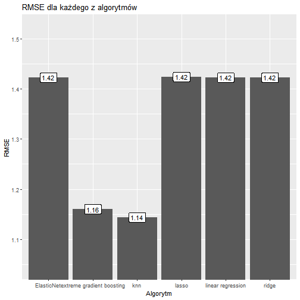
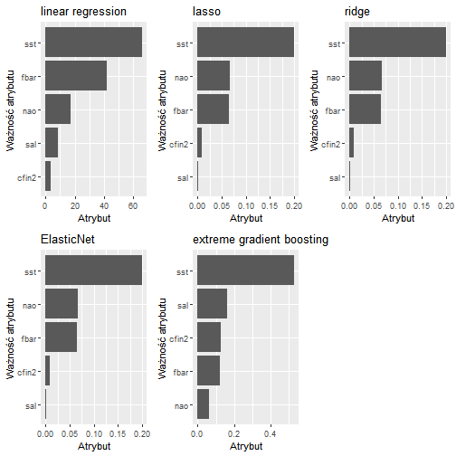

# Raport z analizy długości śledzia oceanicznego

Animacja jak i cały raport są dostępne poprzez aplikację napisaną z wykorzystaniem biblioteki `shiny`. Aby uruchomić aplikację należy, w konsoli R wpisać komendę:

```
library(shiny)
runApp()
```

## Cel analizy

Celem analizy jest określenie jakie mogą być główne przyczyny stopniowego zmniejszania się długości śledzi oceanicznych wyławianych w Europie.

## Zbiór danych

Na przestrzeni ostatnich lat zauważono stopniowy spadek rozmiaru śledzia oceanicznego wyławianego w Europie. Do analizy zebrano pomiary śledzi i warunków w jakich żyją z ostatnich 60 lat. Dane były pobierane z połowów komercyjnych jednostek. W ramach połowu jednej jednostki losowo wybierano od 50 do 100 sztuk trzyletnich śledzi. Zbiór danych zawiera 52582 rekordy, każdy z nich posiada 16 atrybutów:
* indeks
* `length`: długość złowionego śledzia [cm],
* `cfin1`: dostępność planktonu [zagęszczenie Calanus finmarchicus gat. 1],
* `cfin2`: dostępność planktonu [zagęszczenie Calanus finmarchicus gat. 2],
* `chel1`: dostępność planktonu [zagęszczenie Calanus helgolandicus gat. 1],
* `chel2`: dostępność planktonu [zagęszczenie Calanus helgolandicus gat. 2],
* `lcop1`: dostępność planktonu [zagęszczenie widłonogów gat. 1],
* `lcop2`: dostępność planktonu [zagęszczenie widłonogów gat. 2],
* `fbar`: natężenie połowów w regionie [ułamek pozostawionego narybku],
* `recr`: roczny narybek [liczba śledzi],
* `cumf`: łączne roczne natężenie połowów w regionie [ułamek pozostawionego narybku],
* `totaln`: łączna liczba ryb złowionych w ramach połowu [liczba śledzi],
* `sst`: temperatura przy powierzchni wody [°C],
* `sal`: poziom zasolenia wody [Knudsen ppt],
* `xmonth`: miesiąc połowu [numer miesiąca],
* `nao`: oscylacja północnoatlantycka [mb]

Brakujące dane zostały oznaczone jako `?` w oryginalnym zbiorze danych.

Wszystkie funkcje używane w analizie są zapiane w pliku `functions.R`, załadujmy jego zawartość:


## Wykorzystane biblioteki
```
library(ggplot2)
library(reshape2)
library(caret)
library(dplyr)
```


## Ładowanie danych

Dane zostały załadowane z podaniem typów kolumn oraz wskazaniem, że brakujące dane są oznaczone przez `?`.


```r
loadData <- function(filename)
{
  read.csv(file = filename,
           header = TRUE,
           sep = ',',
           comment.char = "",
           na.strings = "?",
           colClasses = c("integer", "numeric", "numeric", "numeric", 
                          "numeric", "numeric", "numeric", 
                          "numeric", "numeric", "factor", 
                          "numeric", "numeric", "numeric", 
                          "numeric", "numeric", "numeric"))
}
herringsFilename <- 'files/herrings.csv'
rawData <- loadData(herringsFilename)
```

## Wstępne przetwarzanie danych

Wstępne przetwarzanie danych obejmowało usunięcie pierwszego atrybutu `indeks` oraz zastąpienie danych brakujących przez średnią (brakujące dane występowały w około 10 tys. wierszy). Wydaje się jednak, iż najlepszym sposobem na uzupełnienie danych byłoby obliczenie średniej z np. 10 poprzednich i 10 kolejnych wierszy. Taka metoda wydaje się sensowna, ponieważ dane były zapisywane chronologicznie, natomiast używanie średniej z 60 lat dla brakującej danej jest bardzo niedokładnym przybliżeniem.


```r
herringsData <- transformData(rawData)
```

Oprócz tych przekształceń została dodana jeszcze jedna kolumna w której zostały zapisany rok, z któego pochodzi dany rekord.
Patrząc na atrybut `recr` wraz z atrybutem `cumf` widać, iż dla wierszy, które mają taką samą wartość `recr` mamy takie same wartości `cumf`. To dosyć logiczne, ponieważ oba atrybuty agregują wartości dla całego roku, stąd pytanie ile jest takich unikatowych wartości:


```r
length(unique(rawData$recr))
```

```
## [1] 52
```

```r
length(unique(rawData$cumf))
```

```
## [1] 52
```

Patrząc na te wyniki można by przypuszczać, iż dane nie są z 60 lat a z 52 lat. Jednkaże, unikatowe wartości dla danego roku sa porozdzielane innymi wartościami/innymi latami, co zaprzecza założeniu o chronologii danych.
Dlatego też, aby wyznaczyć rok wykorzystano kolumnę `recr`, która wskazuje roczny narybek.

```
years_distinct <- getYearsDistinct(data)
dataWithYears <- mutate(dataWithYears, year_=assignYear(recr, years_distinct))
```

W ten sposób dodajemy kolumnę o nazwie `year_`.

Ostatecznie, aby utrzymać założenie o chronologiczności danych, założono, że lat jest 60 i podzielono je na równe 60, następujących po sobie częsci. W ten sposób otrzymano około 876 rekordów na rok.

```
numberOfYears <- 60
numberOfHerringsInOneYear <- nrow(data) %/% (numberOfYears-1)
dataWithYears <- data %>%
  mutate(year = 1:n() %/% numberOfHerringsInOneYear + 1)
```

(Ostatnie dwa snippety znajdują się w funkcji `addYearsColumns`)
Jednakże, powyższe operacje nie są wykonywane razem ze wstępnym przetwarzaniem danych, ich wyniki są zapisywane do innej zmiennej, tak by dodane kolumny nie uczwstniczyły w treningu modeli.


```r
herringsDataYears <- addYearsColumns(herringsData)
```

Atrybut `recr` podczas ładowania był traktowany jako wartość typu `factor`, dla łatwości analizy lat, jednakże przekonwertujemy go teraz do typu numeric, żeby uniknąć problemów przy predykcji.


```r
herringsData$recr <- as.numeric(herringsData$recr)
```

## Podsumowanie zbioru danych

Rozmiar zbioru i jego atrybuty zostały opisane powyżej, w celu podsumowania zbioru danych możemy posłużyć się następującą funkcją:


```r
dataSummary(herringsData)
```

```
## [1] "Dimensions of dataset:"
## [1] 52582    15
##      length         cfin1             cfin2             chel1       
##  Min.   :19.0   Min.   : 0.0000   Min.   : 0.0000   Min.   : 0.000  
##  1st Qu.:24.0   1st Qu.: 0.0000   1st Qu.: 0.2778   1st Qu.: 2.469  
##  Median :25.5   Median : 0.1333   Median : 0.7012   Median : 6.083  
##  Mean   :25.3   Mean   : 0.4458   Mean   : 2.0248   Mean   :10.006  
##  3rd Qu.:26.5   3rd Qu.: 0.3603   3rd Qu.: 1.9973   3rd Qu.:11.500  
##  Max.   :32.5   Max.   :37.6667   Max.   :19.3958   Max.   :75.000  
##      chel2            lcop1              lcop2             fbar       
##  Min.   : 5.238   Min.   :  0.3074   Min.   : 7.849   Min.   :0.0680  
##  1st Qu.:13.589   1st Qu.:  2.5479   1st Qu.:17.808   1st Qu.:0.2270  
##  Median :21.435   Median :  7.1229   Median :25.338   Median :0.3320  
##  Mean   :21.221   Mean   : 12.8108   Mean   :28.419   Mean   :0.3304  
##  3rd Qu.:27.193   3rd Qu.: 21.2315   3rd Qu.:37.232   3rd Qu.:0.4560  
##  Max.   :57.706   Max.   :115.5833   Max.   :68.736   Max.   :0.8490  
##       recr            cumf             totaln             sst       
##  Min.   : 1.00   Min.   :0.06833   Min.   : 144137   Min.   :12.77  
##  1st Qu.:18.00   1st Qu.:0.14809   1st Qu.: 306068   1st Qu.:13.63  
##  Median :28.00   Median :0.23191   Median : 539558   Median :13.86  
##  Mean   :28.09   Mean   :0.22981   Mean   : 514973   Mean   :13.87  
##  3rd Qu.:40.00   3rd Qu.:0.29803   3rd Qu.: 730351   3rd Qu.:14.16  
##  Max.   :52.00   Max.   :0.39801   Max.   :1015595   Max.   :14.73  
##       sal            xmonth            nao          
##  Min.   :35.40   Min.   : 1.000   Min.   :-4.89000  
##  1st Qu.:35.51   1st Qu.: 5.000   1st Qu.:-1.89000  
##  Median :35.51   Median : 8.000   Median : 0.20000  
##  Mean   :35.51   Mean   : 7.258   Mean   :-0.09236  
##  3rd Qu.:35.52   3rd Qu.: 9.000   3rd Qu.: 1.63000  
##  Max.   :35.61   Max.   :12.000   Max.   : 5.08000
```


Na podstawie podsumowania wartości atrybutów widać, iż w roku, w którym zebrano dane najwięcej śledzi zostało wyłowionych w okresie od lipca do października, przy czym szczyt nastąpił w sierpniu. Długość śledzi waha się między 19, a 32.5 centrymetra, aczkolwiek większość śledzi ma rozmiar od 24 do 26.5 centymetrów, co jest widoczne na powyższym wykresie. Widzimy również, że rozkład długości śledzia w każdym miesiącu jest podobny i przypomina rozkład normalny.

## Analiza wartości atrybutów

Najbardziej oczywistymi wykresami są te ilustrujące zmiany rozmiaru śledzia w czasie. Biorąc pod uwagę wszystkie rekordy, bez podziału na lata, otrzymujemy następujący wykres:


```r
variablesAnalysis.lengthAll(herringsData)
```


Jak widać na powyższym wykresie rzeczywiście nastąpił spadek średniej długości śledzia w ostanich latach, jednakże widzimy mały wzrost na końcu.
Biorąc pod uwagę agregację długości śledzia, poprzez wartość średnią w każdym roku, przy założeniu, że dane są uporządkowane chronologicznie oraz, że mamy doczynienia z 60 latami możemy zaobserwować trochę inny kształt wykresu:


```r
variablesAnalysis.lengthByYear(herringsDataYears)
```


Po agrefacji danych widzimy, iż zmiana jest o wiele bardziej widoczna. W tym przypadku atrybut rok jest generowany biorąc pod uwagę, iż jeden rok to kolejne prawie 900 rekordów (w ten sposób otrzymamy 60 lat dla całego zbioru).
Patrząc na wykres agregujący długości śledzia, poprzez wartość średnią w każdym roku, bazując na atrybucie `recr`:


```r
variablesAnalysis.lengthByYear_(herringsDataYears)
```


widzimy iż jest on bardziej podobny do pierwszego wykresu. Ostatnia agregacja, na podstawie parametru `recr`, została wykonana ponieważ nie wyglądają na zbierane chronologicznie. 

Poniżej możemy zaobserwować rozkład danych w poszczególych atrybutach, które zostaną użyte do predykcji:


```r
variableAnalysis.drawHistograms(analysedHerringsData)
```

```
## `stat_bin()` using `bins = 30`. Pick better value with `binwidth`.
## `stat_bin()` using `bins = 30`. Pick better value with `binwidth`.
## `stat_bin()` using `bins = 30`. Pick better value with `binwidth`.
## `stat_bin()` using `bins = 30`. Pick better value with `binwidth`.
## `stat_bin()` using `bins = 30`. Pick better value with `binwidth`.
## `stat_bin()` using `bins = 30`. Pick better value with `binwidth`.
## `stat_bin()` using `bins = 30`. Pick better value with `binwidth`.
## `stat_bin()` using `bins = 30`. Pick better value with `binwidth`.
## `stat_bin()` using `bins = 30`. Pick better value with `binwidth`.
## `stat_bin()` using `bins = 30`. Pick better value with `binwidth`.
## `stat_bin()` using `bins = 30`. Pick better value with `binwidth`.
```


Atrybut `length` już analizowaliśmy, widzimy, iż rozkłady w atrybutach `cfin1`, `cfin2`, `lcop1` są mocno przekrzywione, przypominając trochę rozkład gamma. W przypadku atrybutu `xmonth` mamy wyraźne wskazanie na miesiące letnie co jest związane z samym procesem wyławiania, jeżeli chodzi o atrybut `recr` to widać, iż mniej więcej wyławiono podobne liczby śledzi w różnych latach, tylko w przypadku 2 lat nastąpiła duża zmiana.


## Analiza korelacji między zmiennymi

Korelację wykonano dla następujących zmiennych:

```r
columnsForCorrelation <- c("length", "cfin1",  "cfin2",  "chel1",  "chel2",
                         "lcop1",  "lcop2",  "fbar", "cumf",
                         "sst", "sal", "xmonth", "nao")
```

Oprócz dolnotrójkątnej macierzy korelacji


```r
variableAnalysis.drawCorrelationPlot(herringsData)
```


Funkcja `variableAnalysis.drawCorrelationPlot` oblicza korelacje między zmiennymi, omijając dodane atrybuty `year` oraz `year_` oraz te, które znajdują się oryginalnie w zbiorze ale są związane wielkością połowu - `recr`:  roczny narybek, `totaln`:  łączna liczba ryb złowionych w ramach połowu. Pozostawiono atrybuty związane z natężeniami połowów jako, iż liczba połowów może negatywnie wpływać na możliwości rozmnażania śledzia. Jednkaże, patrząc na korelacje między atrybutami `fbar`, `cumf` a `length` nie widać żadnych korelacji, stąd możnaby wnioskować, iż natężenie połowów nie wpływa na wielkość śledzia. Nieznaczą korelację ujemną można zauważyć między atrybutem `sst` (temperatura przy powierzchni wody), a długością śledzia. 

Oprócz wyznaczenia macierzy korelacji, wyznaczono te atrybuty, które można usunąć ze względu na zbyt dużą korelację z innymi, są to atrybuty:


```r
columnsToRemove <- variableAnalysis.getTooCorrelatedColumns(herringsData)
print(columnsToRemove)
```

```
## [1] "chel1" "lcop2" "cumf"
```

i te atrybuty, wraz z `totaln` usunięto ze zbioru.


```r
columnsToRemove <- c(columnsToRemove, "totaln")
analysedHerringsData <- variableAnalysis.removeColumns(herringsData, columnsToRemove)
```

`totaln` został usunięty ze względu na fakt, iż liczba śledzi w danym połowie nie powinna decydować o średniej długości śledzia w danym roku.
Dodatkowo wykonano wstępną selekcję atrybutów za pomocą metody `Recursive Feature Elimination`, która wytypowała następujące 5 najważniejszych atrybutów:


```r
importantFeatures <- featureSelection.rankImportance(predictionData$train, floor(dim(rawData)[1]*.05))
print(importantFeatures)
```

```
## 
## Recursive feature selection
## 
## Outer resampling method: Cross-Validated (10 fold, repeated 3 times) 
## 
## Resampling performance over subset size:
## 
##  Variables  RMSE Rsquared   MAE  RMSESD RsquaredSD   MAESD Selected
##          1 1.680  0.02707 1.344 0.06480    0.01544 0.04248         
##          2 1.360  0.36333 1.109 0.05655    0.05022 0.04653         
##          3 1.331  0.38988 1.076 0.05639    0.04684 0.04107         
##          4 1.285  0.43165 1.034 0.05940    0.04657 0.04474         
##          5 1.285  0.43162 1.034 0.05961    0.04692 0.04441         
##         10 1.272  0.44309 1.022 0.06274    0.04615 0.04820        *
## 
## The top 5 variables (out of 10):
##    fbar, sst, sal, cfin2, nao
```

Selekcja odbyła się na 5% wszystkich przykładów zbioru treningowego. Na razie nie korzystamy z atrybutów wytypowanych przez tę metodę.

## Prezentacja zmiany rozmiaru śledzi w czasie

Jak wyjaśniono na początku, prezentacja została przedstawiona w aplikacji z użyciem biblioteki `shiny`.

## Regresor przewidujący rozmiar śledzia

Dane podzielono na zbiór treningowy orazy testowy w relacji 7:3 za pomocą funkcji `createDataPartition` .


```r
predictionData <- predictions.prepareData(analysedHerringsData)
```

```
## [1] "Zbiór treningowy"
## [1] 36810    11
## [1] "Zbiór testowy"
## [1] 15772    11
```

Do predykcji długości śledzia zostały wykorzystane następujące metody:
 * regresji liniowej
 * lasso
 * ridge
 * ElasticNet
 * KNN
 * Extreme Gradient Boosting
 
 
 ```r
 methods <- list(
  list(name="linear regression", fun=predictions.lm),
  list(name="lasso",fun=predictions.lasso),
  list(name="ridge",fun=predictions.ridge),
  list(name="ElasticNet",fun=predictions.elasticNet),
  list(name="knn",fun=predictions.knn),
  list(name="extreme gradient boosting", fun = predictions.xGradientBoosting))
 ```
 
Aby uspójnić uczenie modeli wykorzystano interfejs oferowany przez bibliotekę `caret`. W treningu każdej z metod wykorzystano 10-krotną walidację krzyżową na danych treningowych. Dodatkowo zastosowano preprocessing danych w postaci skalowania i centrowania danych. Każdy z modeli może mieć swoje parametry. Do regresji liniowej oraz metody `lasso`, `ridge` i `ElasticNet`  nie zostały dodane żadne. W przypadku `KNN` parametr `k` został dobrany na wartość 3 (były testowane wartości 3, 5, 7, 9 jednakże nie było między nimi dużych różnic). Dla metody `Extreme gradient boosting`, która miała najwięcej parametrów do ustawienia wybrano, następujące parametry:
 * nrounds = c(100) (testowane były wartości 100 oraz 200, różnice nie były duże),
 * max_depth = c(25) (testowane były wartości 10, 15, 20 oraz 25 dla której otrzymano najlepszy wynik),
 * colsample_bytree = c(.9) (testowane były wartości .5, .6, .7, .8 oraz .9 dla której otrzymano najlepszy wynik),
 * eta = 0.1,
 * gamma=0,
 * min_child_weight = 1,
 * subsample = 1.

Po treningu na wszystkich metodach z wykorzystaniem danych treningowych


```r
methodsWithPredictions <- predictions.runMethods(methods, predictionData)
```

```
## [1] "running linear regression"
## [1] "time elapsed 2.15606498718262 secs"
## [1] "running lasso"
## [1] "time elapsed 3.53715991973877 secs"
## [1] "running ridge"
## [1] "time elapsed 7.73420190811157 secs"
## [1] "running ElasticNet"
## [1] "time elapsed 7.27961015701294 secs"
## [1] "running knn"
## [1] "time elapsed 18.8241930007935 secs"
## [1] "running extreme gradient boosting"
## [1] "time elapsed 37.6573038101196 secs"
```

wykonano zbiorczy wykres, na którym widać relacje między rzeczywistymi, a przewidywanymi długościami śledzi dla każdej z metod:


```r
predictionCharts <- lapply(methodsWithPredictions, function(x)
{
  predictions.predictionChart(x$predictions, x$name, predictionData) 
})
plot_grid(plotlist = predictionCharts)
```


aby lepiej zobrazować dokładność predykcji obliczono wartości RMSE oraz R^2 dla każdej z metod (dodatkowo został wzięty pod uwagę czas treningu w sekundach):


```r
stats <- predictions.aggregateStats(methodsWithPredictions)
kable(stats, format="markdown")
```


|                          |     RMSE| R.Squared|      Time|
|:-------------------------|--------:|---------:|---------:|
|linear regression         | 1.422729| 0.2640898|  2.156065|
|lasso                     | 1.423847| 0.2629328|  3.537160|
|ridge                     | 1.422728| 0.2640901|  7.734202|
|ElasticNet                | 1.422728| 0.2640901|  7.279610|
|knn                       | 1.143914| 0.5242624| 18.824193|
|extreme gradient boosting | 1.160252| 0.5105761| 37.657304|

które można porówanać na poniższych wykresach:


```r
predictions.plotStats(stats, "RMSE", "RMSE")
```



Widzimy, iż najlepszą wartośc otrzymały algorytmy `KNN` oraz `Extreme Gradient Boosting`, pierwsze cztery metody regresji otrzymały podobne miary RMSE. Odpowiednio układa się ranking w przypadku miary `R^2`:


```r
predictions.plotStats(stats, "R.Squared", "R^2")
```


Aby wybrać najlepszy można dodac trzeci parametr, czas, który dla wszystkich algorytmów wyglądał następująco:


```r
predictions.plotStats(stats, "Time", "Czas wykonywania [s]")
```


Stąd można stwierdzić, iż `KNN` jest w tym przypadku najlepszym wyborem. 
Patrząc na ważności atrybutów


```r
importancesCharts <- lapply(methodsWithPredictions, function(x)
{
  predictions.importanceCharts(x)
})
plot_grid(plotlist = importancesCharts)
```


możemy wytypować listę 5-ciu najważniejszych:


```r
bestAttributes <- c("sst", "nao", "fbar", "sal", "cfin1", "length")
```

## Analiza ważności atrybutów najlepszego znalezionego modelu regresji

W tej części przedstawimy zależności wytypowanych atrybutów (`sst`, `nao`, `fbar`, `sal`, `cfin1`) względem długości śledzia.
Analiza jest wykonana na danych zagregowanych na podstawie atrybutu `year`


```r
mean_by_year <- herringsDataYears %>%
                  select(c(bestAttributes, "year")) %>%
                  group_by(year) %>%
                  summarise_all(mean)
```

Bezsprzecznie, najważniejszym atrybutem jest `sst`, czyli temperatura przy powierzchni wody, im jest ona mniejsza tym większa jest długość śledzia. Poniższe wykresy, są zagregowanymi wartościami na podstawie atrybutu `year`:


```r
variablesAnalysis.lengthByYearVsVariable(mean_by_year, "sst")
```


Kolejną zmienną jest `nao`, czyli oscylacja północnoatlantycka, która jest również odwrotnie proporcjonalna do długości śledzia

```r
variablesAnalysis.lengthByYearVsVariable(mean_by_year, "nao")
```


Ważną rolę odgrywa również ułamek pozostawionego narybku, im więcej pozostawionych ryb, tym dłuższych śledzi możemy się spodziewać
co jest dosyć ważnym wskażnikiem, ponieważ jest to wartość bezpośrednio kontrolowana przez człowieka.


```r
variablesAnalysis.lengthByYearVsVariable(mean_by_year, "fbar")
```


Na koniec analiza dwóch parametrów, które nie wykazują klarownych relacji z długością śledzia, jednakże były ważne przy treningu modeli. Jeżeli chodzi o atrybut `sal`, odpowiadającą zasoleniu wody relacja wygląda następująco:


```r
variablesAnalysis.lengthByYearVsVariable(mean_by_year, "sal")
```


Natomiast jeżeli chodzi o atrybut `cfin1` to mamy następujący wykres


```r
variablesAnalysis.lengthByYearVsVariable(mean_by_year, "cfin1")
```


## Uczenie modelu na podzbiorze 5-ciu najważniejszych atrybutów

Teraz wykorzystamy tylko te 5 atrybutów (oraz szósty decyzyjny) do predykcji długości śledzia, aby sprawdzić, czy rzeczywiście wystarczą one do dobrej predykcji:


```r
methods <- list(
  list(name="linear regression", fun=predictions.lm),
  list(name="lasso",fun=predictions.lasso),
  list(name="ridge",fun=predictions.ridge),
  list(name="ElasticNet",fun=predictions.elasticNet),
  list(name="extreme gradient boosting", fun = predictions.xGradientBoosting))

bestAttributesData <- herringsData[, bestAttributes]
bestPredictionData <- predictions.prepareData(bestAttributesData)
```

```
## [1] "Zbiór treningowy"
## [1] 36810     6
## [1] "Zbiór testowy"
## [1] 15772     6
```

```r
methodsWithPredictionsBestData <- predictions.runMethods(methods, bestPredictionData)
```

```
## [1] "running linear regression"
## [1] "time elapsed 1.99865078926086 secs"
## [1] "running lasso"
## [1] "time elapsed 2.45959997177124 secs"
## [1] "running ridge"
## [1] "time elapsed 4.25805902481079 secs"
## [1] "running ElasticNet"
## [1] "time elapsed 5.14057493209839 secs"
## [1] "running extreme gradient boosting"
## [1] "time elapsed 24.6836030483246 secs"
```

```r
bestStats <- predictions.aggregateStats(methodsWithPredictionsBestData)
```

W tym przypadku nie wykorzystaliśmy metody `KNN` ze względu na dziwny błąd, który wynika ze zbyt małej liczby wykorzystanych atrybutów.
Analizując wyniki miar `RMSE`


```r
predictions.plotStats(bestStats, "RMSE", "RMSE")
```


oraz `R^2` 


```r
predictions.plotStats(bestStats, "R.Squared", "R^2")
```


Widzimy, iż jakość predykcji nie zmieniła się w znaczącym stopniu, natomiast czasy treningu dosyć mocno się obniżyły


```r
predictions.plotStats(bestStats, "Time", "Czas wykonywania [s]")
```


Stąd wniosek, iż pozostałe atrybuty w rzeczywistości w bardzo małym stopniu wpływają na wyniki predykcji, a 5 najważniejszych atrybutów wytypowanych podczas uczenia poprzednich modeli wystarczy. Jedyną wadą jest fakt, iż najpierw musimy nauczyc te modele, aby wiedzieć jaki podzbiór atrybutów jest najważniejszy.

Wykonajmy taką samą analizę używając tym razem atrybutów wyłonionych za pomocą wcześniej wspomnianego algorymtu `Recursive Feature Elimination`, która działa bardzo szybko a do jej wykonania użyto jedynie 5% przykładów ze zbioru uczącego, tj. około 1840 przykładów.


```r
print(importantFeatures)
```

```
## 
## Recursive feature selection
## 
## Outer resampling method: Cross-Validated (10 fold, repeated 3 times) 
## 
## Resampling performance over subset size:
## 
##  Variables  RMSE Rsquared   MAE  RMSESD RsquaredSD   MAESD Selected
##          1 1.680  0.02707 1.344 0.06480    0.01544 0.04248         
##          2 1.360  0.36333 1.109 0.05655    0.05022 0.04653         
##          3 1.331  0.38988 1.076 0.05639    0.04684 0.04107         
##          4 1.285  0.43165 1.034 0.05940    0.04657 0.04474         
##          5 1.285  0.43162 1.034 0.05961    0.04692 0.04441         
##         10 1.272  0.44309 1.022 0.06274    0.04615 0.04820        *
## 
## The top 5 variables (out of 10):
##    fbar, sst, sal, cfin2, nao
```

```r
featureSelection <- names(importantFeatures$fit$coefficients[2:6])
print(featureSelection)
```

```
## [1] "fbar"  "sst"   "sal"   "cfin2" "nao"
```

```r
methods <- list(
  list(name="linear regression", fun=predictions.lm),
  list(name="lasso",fun=predictions.lasso),
  list(name="ridge",fun=predictions.ridge),
  list(name="ElasticNet",fun=predictions.elasticNet),
  list(name="extreme gradient boosting", fun = predictions.xGradientBoosting))

selectedAttributes <- herringsData[, c(featureSelection, 'length')]
selectedPredictionData <- predictions.prepareData(selectedAttributes)
```

```
## [1] "Zbiór treningowy"
## [1] 36810     6
## [1] "Zbiór testowy"
## [1] 15772     6
```

```r
methodsWithPredictionsSelectedData <- predictions.runMethods(methods, selectedPredictionData)
```

```
## [1] "running linear regression"
## [1] "time elapsed 4.25843787193298 secs"
## [1] "running lasso"
## [1] "time elapsed 2.89672207832336 secs"
## [1] "running ridge"
## [1] "time elapsed 5.588623046875 secs"
## [1] "running ElasticNet"
## [1] "time elapsed 5.76843905448914 secs"
## [1] "running extreme gradient boosting"
## [1] "time elapsed 19.1989498138428 secs"
```

```r
bestImportancesCharts <- lapply(methodsWithPredictionsSelectedData, function(x)
{
  predictions.importanceCharts(x)
})
plot_grid(plotlist = bestImportancesCharts)
```



```r
selectedAttrStats <- predictions.aggregateStats(methodsWithPredictionsSelectedData)
predictions.plotStats(selectedAttrStats, "RMSE", "RMSE")
```


```r
predictions.plotStats(selectedAttrStats, "R.Squared", "R^2")
```


```r
predictions.plotStats(selectedAttrStats, "Time", "Czas wykonywania [s]")
```


Jak widać, wyniki `RMSE` oraz `R^2` są takie same, dla metody `Extreme Gradient Boosting` jak w przypadku poprzedniego podzbioru 5 atrybutów. Biorąc pod uwagę, iż taki podzbiór daje takie same wyniki jak poprzedni podzbiór ale nie wymaga uruchamiania modeli na wszystkich danych, wydaje się, iż użycie w tym przypadku selekcji atrybutów jest najlepszym i najszybszym rozwiązaniem problemu predykcji długości śledzia.

